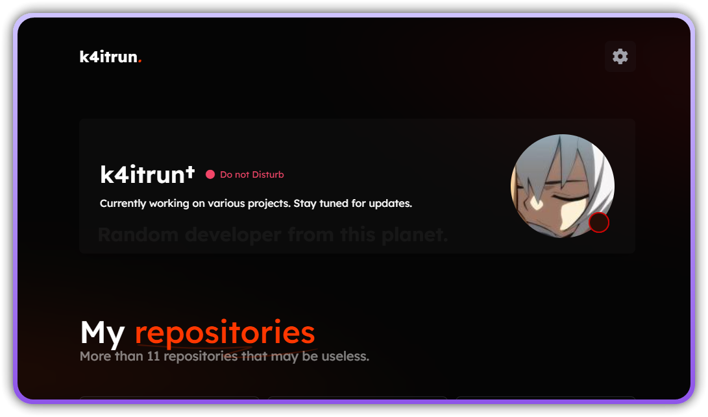

<div align="center">

# Next.js Site
This is a simple Next.js site template.

</div>

## Features

- Server-side rendering (SSR)
- Static site generation (SSG)
- API routes
- Responsive design
- Tailwind CSS integration (if applicable)
- TypeScript support (if applicable)

## Screenshots


## Installation

1. Clone the repository:

   ```bash
   git clone https://github.com/k4itrun/k4itrun.github.io
   ```

2. Navigate to the project directory:

   ```bash
   cd k4itrun.github.io
   ```

3. Install dependencies:

   ```bash
   npm install
   ```

   Or, if you use Yarn:

   ```bash
   yarn
   ```

4. Run the development server:

   ```bash
   npm run dev
   ```

   Or with Yarn:

   ```bash
   yarn dev
   ```

5. Open your browser and visit [http://localhost:3000](http://localhost:3000) to see the site.

## Environment Variables

You can configure environment variables in the `.env.local` file. Example:

| Variable              | Description                                                      | Required |
| --------------------- | ---------------------------------------------------------------- | -------- |
| `WEBHOOK` | Discord Webhook URL for contact form                             | `No` |
| `DISCORD_ID` | Discord Webhook URL for contact form                             | `Yes` |

## Deployment

To deploy this site, you can use platforms like:

- Vercel (recommended for Next.js)
- Netlify
- AWS
- DigitalOcean

Simply push your code to a GitHub repository, and connect it to your preferred platform for continuous deployment.

### ▲ Vercel (recommended)

[](https://vercel.com/new/clone?repository-url=https%3A%2F%2Fgithub.com%2Fk4itrun%2Fk4itrun.github.io&env=GITHUB_ACCESS_TOKEN,DISCORD_WEBHOOK_URL&envDescription=Environment%20Variables%20Docs&envLink=https%3A%2F%2Fgithub.com%2Fk4itrun%2Fk4itrun.github.io%23-self-hosting&project-name=portfolio&repo-name=k4itrun-portfolio&demo-title=Example%20deploy&demo-description=Example%20production%20deploy%20from%20Github%20Repository&demo-url=https%3A%2F%2F9ll.fun&demo-image=https%3A%2F%2Fi.imgur.com%2FT4VsRuy.png)

## License

This project is licensed under the MIT License - see the [LICENSE](LICENSE) file for details.